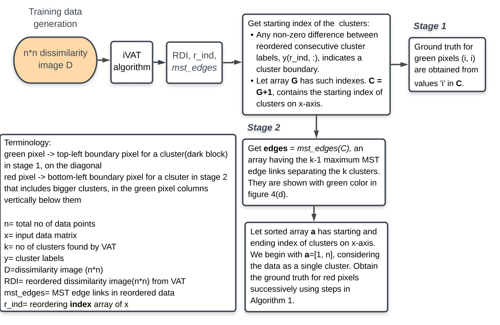
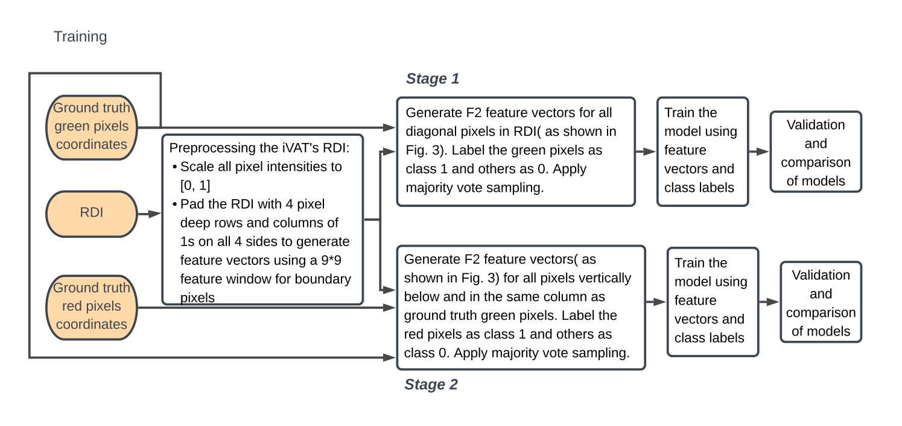
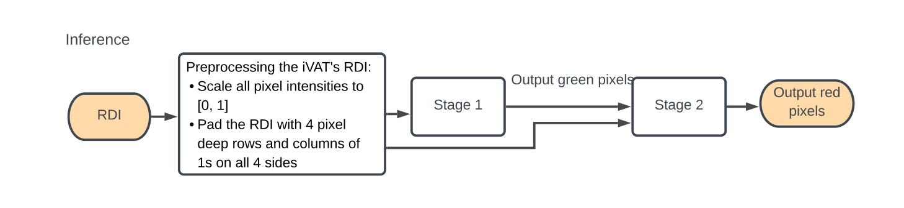

The proposed algorithm flowchart and the steps followed for training data generation, training, and inference are as shown:

 

Training data generation

 

Stage 1 and 2 model training

 

Inferring the clustering tendency for real data by representing it as a reordered dissimilairty image (RDI)

